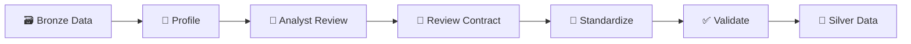

# 🧹 SEPRO Data Cleaning Project

### Turning raw business data into trusted, analysis-ready data

Real-world data can contain missing values, inconsistent text, duplicates, incorrect datatypes, and unclear relationships.

This project shows how I handle those issues as a **Data Analyst** for Silver Layer belong to Medallion architecture [Bronze Layer (Raw Data) -> Silver Layer (Validated Data) -> Gold Layer (Enriched Data)]:

> **Machine detects → Analyst decides → Pipeline executes → Validation proves.**



## 🧠 Decision Framework

Not every detected issue should be automatically fixed.

For each Data Quality issue, I choose:

- 🔧 **FIX** — apply an approved transformation.
- ✅ **KEEP** — keep the value because it is valid or acceptable business data.
- 🛑 **BLOCK** — stop the build because more investigation is required.

Examples:

```text
Missing phone number
→ KEEP
→ Phone is optional

Whitespace in customer name
→ FIX
→ STANDARDIZE_TEXT

Confirmed duplicate import
→ FIX
→ REMOVE_EXACT_DUPLICATES

Conflicting invoice records
→ BLOCK
→ Investigate source data
```

---

# ▶️ How to Use

The project uses three main commands.

## 1. Profile and create review files

```powershell
python run_review.py
```

Main outputs:

```text
reports/bronze_profile.csv
reports/data_quality_report.csv

review/silver_schema_review.csv
review/data_quality_decisions.csv
```

### Review `silver_schema_review.csv`

Use this file to review:

```text
table / column names
datatype
nullable
primary key
foreign key
table grain
```

Important:

```text
source_column = original Bronze column
column_name   = final Silver column
```

### Review `data_quality_decisions.csv`

Main fields you edit:

```text
decision
action
reason
```

Common FIX actions:

| Issue | Action |
|---|---|
| Missing / fake NULL | `STANDARDIZE_NULL_MARKERS` |
| Whitespace | `STANDARDIZE_TEXT` |
| Text variants | `APPLY_VALUE_MAPPING` |
| Exact duplicate | `REMOVE_EXACT_DUPLICATES` |

---

## 2. Compile analyst decisions

After reviewing both CSV files:

```powershell
python review_to_json.py
```

Output:

```text
review/silver_review_contract.json
```

The CSV files are for **human review**.

The JSON file is the **machine execution contract**.

---

## 3. Build Silver

```powershell
python build_silver.py
```

The pipeline will:

```text
Load Bronze
→ Apply approved transformations
→ Validate
→ Publish Silver only if validation passes
```

If validation fails or an issue is `BLOCK`, the build stops.

---

# 📈 Main Outputs

After a successful build:

```text
SQL Server
└── silver.*

reports/
└── standardization_summary.csv

review/
└── silver_before_after_review.csv
```

The Before/After report helps measure:

```text
input vs output rows
duplicates before / after
NULLs before / after
invalid values before / after
changed rows
status
```

---

# 📁 Project Structure

```text
SEPRO_Cleaning_Data/
│
├── config/
├── profiling/
├── standardization/
├── validation/
├── reports/
├── review/
│
├── run_review.py
├── review_to_json.py
├── build_silver.py
└── README.md
```

---

# 🎯 What This Project Demonstrates

- 🔎 Profile data before cleaning
- 🧠 Separate technical anomalies from business meaning
- 🧩 Review table grain before defining keys
- 🧬 Avoid blindly deleting duplicates
- 📝 Keep Data Analyst decisions explicit
- 🧹 Apply only approved transformations
- ✅ Validate before publishing data
- 📈 Compare data quality before and after cleaning

> **The goal is not simply clean data — it is data that I can explain, validate, and trust for analysis.**
