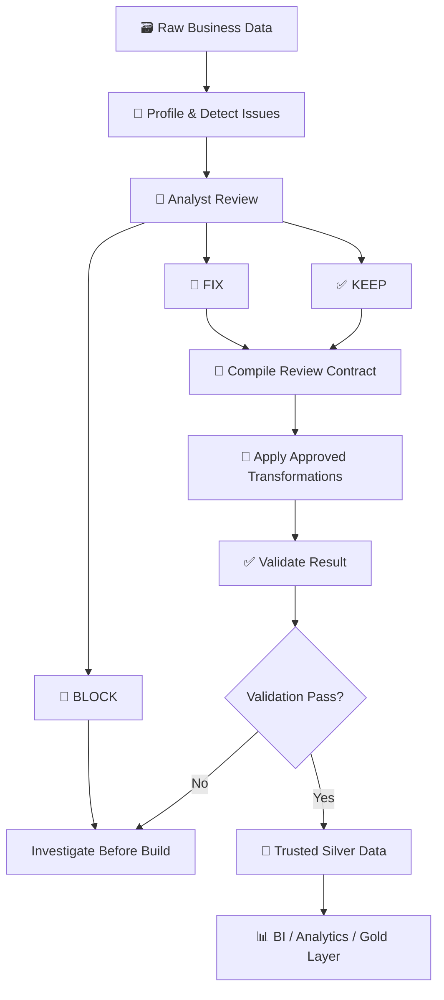

# 🧹 SEPRO Data Cleaning Project

### A Data Analyst workflow for turning raw business data into data that can be trusted

Real-world business data is rarely ready for analysis. It may contain missing values, inconsistent text, duplicate records, unclear table relationships, incorrect datatypes, or values that look unusual but are actually valid business cases.

This project shows how I approach that problem as a **Data Analyst**.

I do not assume that every detected anomaly is an error. The pipeline first **finds potential issues**, then I decide whether each issue should be:

- 🔧 **FIX** — apply an approved transformation.
- ✅ **KEEP** — preserve it because it is valid or acceptable business data.
- 🛑 **BLOCK** — stop the build because more investigation is required.

Only after those decisions are reviewed does the pipeline create an analysis-ready dataset.

> In data-engineering terminology, this cleaned and validated dataset is the **Silver Layer**.  
> In simple terms: it is the trusted step between **raw operational data** and **reporting / analytics**.

---

## 🗺️ Project at a Glance



**Core idea:**

> **Machine detects → Analyst decides → Pipeline executes → Validation proves.**

---

# 1. 🧠 My Data Analyst Thinking Process

Before changing data, I try to answer four questions:

1. **What is happening in the data?**
2. **Is it really a problem, or a valid business condition?**
3. **If it is a problem, what is the safest transformation?**
4. **How can I prove that the result is better and still trustworthy?**

My workflow is therefore:

```text
Understand the data
        ↓
Profile the data
        ↓
Identify potential issues
        ↓
Understand table grain and relationships
        ↓
Review schema decisions
        ↓
Review Data Quality decisions
        ↓
Compile an approved contract
        ↓
Apply only approved fixes
        ↓
Validate the result
        ↓
Publish trusted data
```

---

# 2. 🔎 Profiling Before Cleaning

The source data is stored in SQL Server under:

```text
bronze.*
```

The first stage is intentionally **read-only**.

I inspect:

- row and column counts
- missing values
- fake NULL markers
- exact duplicates
- text variants
- whitespace problems
- datatype patterns
- possible table grain
- candidate primary keys
- candidate foreign keys

The goal at this stage is not to fix anything.

The goal is to understand:

> **What problems actually exist, and where?**

Main machine-generated reports:

```text
reports/bronze_profile.csv
reports/data_quality_report.csv
```

---

# 3. 🕳️ Missing Values Are Not All the Same

I distinguish between **real NULL** and **fake NULL**.

Examples of fake NULL markers:

```text
""
"N/A"
"NULL"
"none"
"-"
"--"
```

But values such as:

```text
unknown
not available
```

are not globally converted to NULL.

For example:

```text
lead_source = "unknown"
```

may mean that the business genuinely does not know the source. That is different from a data-entry failure.

This prevents over-cleaning.

---

# 4. 🧩 Grain Before Keys

A column being unique today does not automatically make it the correct business key.

I first think about the **grain** of the table.

For example, an FX table may represent:

```text
one currency
per date
```

so the logical key could be:

```text
date + currency
```

Similarly, an inventory snapshot might represent:

```text
one product
per warehouse
per snapshot date
```

which could require:

```text
snapshot_date + warehouse_id + product_id
```

The code may propose PK/FK candidates, but the analyst reviews the final grain.

---

# 5. 📝 Human Review Is Part of the Pipeline

The project intentionally separates **machine suggestions** from **analyst decisions**.

`run_review.py` generates:

```text
review/silver_schema_proposal.csv
review/silver_schema_proposal.json
review/silver_schema_review.csv
review/data_quality_decisions.csv
```

## Schema Review

`silver_schema_review.csv` is the human-editable schema decision file.

It contains fields such as:

```text
table_name
silver_table_name
source_column
column_name
datatype
nullable
is_pk
pk_order
is_fk
fk_reference
```

The important distinction is:

```text
source_column = Bronze field
column_name   = final Silver field
```

This lets me safely rename fields while still retaining the original source mapping.

---

# 6. ⚠️ Not Every Data Quality Issue Should Be Fixed

This is one of the main design decisions in the project.

The machine can detect an anomaly, but the analyst decides what it means.

`data_quality_decisions.csv` contains:

```text
issue_id
table_name
column_name
issue_type
issue_count
example
detail
suggested_action
decision
action
reason
```

For every detected issue I choose:

### 🔧 FIX

The issue is valid and should be automatically transformed.

Example:

```text
EXACT_DUPLICATE
Decision = FIX
Action   = REMOVE_EXACT_DUPLICATES
```

### ✅ KEEP

The issue has been reviewed and should remain unchanged.

Example:

```text
phone = NULL
Decision = KEEP
Reason   = Phone is optional for this customer type
```

### 🛑 BLOCK

The issue cannot be safely resolved automatically.

Example:

```text
same invoice_id
but different amount

Decision = BLOCK
Reason   = Requires source-system investigation
```

A BLOCK decision prevents the Silver build from proceeding.

---

# 7. 🧬 Duplicate Handling Depends on Business Meaning

I do not use `drop_duplicates()` blindly.

## Case A — Real duplicate import

```text
order_id | customer | amount
SO001    | ABC      | 100
SO001    | ABC      | 100
```

If the analyst confirms these are duplicate inserts:

```text
Decision = FIX
Action   = REMOVE_EXACT_DUPLICATES
```

One copy is removed.

## Case B — Repeated rows are valid

Two identical-looking records may still represent legitimate events or imports.

Then:

```text
Decision = KEEP
Reason   = Valid repeated event
```

The pipeline preserves them.

## Case C — Same PK, conflicting business values

```text
invoice_id | amount
INV001     | 100
INV001     | 150
```

The pipeline does not guess which one is correct.

The issue remains a hard validation problem until the grain/key or source data is resolved.

---

# 8. ⚙️ CSV for Humans, JSON for Execution

CSV is easier for an analyst to review in Excel or a spreadsheet.

JSON is better for deterministic program execution.

Therefore the workflow is:

```text
silver_schema_review.csv
        +
data_quality_decisions.csv
        ↓
review_to_json.py
        ↓
silver_review_contract.json
        ↓
build_silver.py
```

The final JSON is not manually maintained.

It is **compiled from the analyst decisions**.

This separates:

```text
Human review surface  = CSV
Machine contract      = JSON
```

---

# 9. 🧹 Apply Only Approved Transformations

After the contract is compiled, the standardization layer can perform:

```text
Fake NULL standardization
Whitespace standardization
Business value mapping
Datatype conversion
Currency standardization
Exact duplicate removal
```

But issue-driven transformations only run when the corresponding decision is `FIX`.

Examples:

```text
WHITESPACE + FIX
→ trim/collapse whitespace

WHITESPACE + KEEP
→ preserve original text

EXACT_DUPLICATE + FIX
→ remove exact duplicates

EXACT_DUPLICATE + KEEP
→ preserve duplicates
```

Schema decisions such as datatype, column name, PK, and FK remain part of the approved schema contract.

---

# 10. 💱 Currency Standardization

Transactions may use multiple currencies, so currency logic is treated separately.

Base currency:

```text
VND
```

FX source:

```text
fx_rates_daily
```

Possible aliases:

```text
US$ → USD
$   → USD
VNĐ → VND
RMB → CNY
```

The original monetary amount is preserved.

For configured fields, the pipeline can derive:

```text
fx_rate_to_vnd
amount_vnd
```

Example:

```text
amount         = 10.50 USD
fx_rate_to_vnd = 25,000
amount_vnd     = 262,500
```

This keeps the transformation auditable.

---

# 11. ✅ Validation After Transformation

Cleaning data does not prove that the result is correct.

The standardized candidate is validated again for:

- required columns
- nullability
- datatype consistency
- datatype conversion failures
- primary-key NULLs
- primary-key duplicates
- foreign-key orphans
- exact duplicates according to analyst policy
- currency-code validity
- missing FX rates

The principle is:

> **Transformation changes data. Validation proves whether the result is acceptable.**

---

# 12. 🛡️ Fail-Safe Build Logic

The final build follows:

```text
Approved Contract
        ↓
Standardize
        ↓
Validate
        ↓
PASS?
```

If validation fails or any issue is still `BLOCK`:

```text
STOP
```

No production Silver output should be accepted.

If validation passes:

```text
trusted Silver data
```

is published for downstream analytics.

---

# 13. 📈 Before vs After

The project also measures what changed.

Example output:

```text
review/silver_before_after_review.csv
```

Metrics include:

```text
input_rows
output_rows
changed_rows
duplicate_before
duplicate_after
null_before
null_after
invalid_before
invalid_after
status
```

The objective is not necessarily to make every metric zero.

Some missing values or repeated records may be legitimate and intentionally kept.

The goal is to make the result:

> **consistent, explainable, validated, and trustworthy for analysis.**

---

# 14. ▶️ How to Run

## Step 1 — Profile and create review files

```powershell
python run_review.py
```

Review/edit:

```text
review/silver_schema_review.csv
review/data_quality_decisions.csv
```

## Step 2 — Compile analyst decisions

```powershell
python review_to_json.py
```

Output:

```text
review/silver_review_contract.json
```

If a review row is incomplete, the contract is not created.

## Step 3 — Build Silver

```powershell
python build_silver.py
```

The build reads only the compiled contract.

---

# 15. 📁 Project Structure

```text
SEPRO_Cleaning_Data/
│
├── config/
│
├── profiling/
│   ├── data_quality.py
│   └── schema_proposal.py
│
├── standardization/
│   ├── decision_policy.py
│   ├── landing_data/
│   │   ├── null_standardization.py
│   │   ├── text_standardization.py
│   │   ├── value_standardization.py
│   │   ├── datatype_standardization.py
│   │   ├── currency_standardization.py
│   │   └── duplicate_handling.py
│   ├── rules/
│   │   └── standardization_rules.json
│   └── standardize_silver.py
│
├── validation/
│   └── validate_silver.py
│
├── reports/
├── review/
│
├── run_review.py
├── review_to_json.py
├── build_silver.py
└── README.md
```

---

# 🎯 What This Project Demonstrates

This project is more than a Python cleaning script.

It demonstrates how I approach ambiguous data-quality problems as a Data Analyst:

- 🔎 profile before changing data
- 🧠 distinguish technical anomalies from business meaning
- 🧩 understand grain before defining keys
- 🕳️ avoid blindly filling missing values
- 🧬 treat duplicates according to business context
- 📝 keep analyst decisions explicit and reviewable
- ⚙️ separate human CSV review from machine JSON execution
- 🧹 apply only approved transformations
- ✅ validate after transformation
- 📈 measure Before vs After results
- 🛑 stop the build when the data cannot be safely resolved

The final objective is not simply **clean data**.

It is:

> **data that I can explain, validate, and trust before using it for analysis.**
